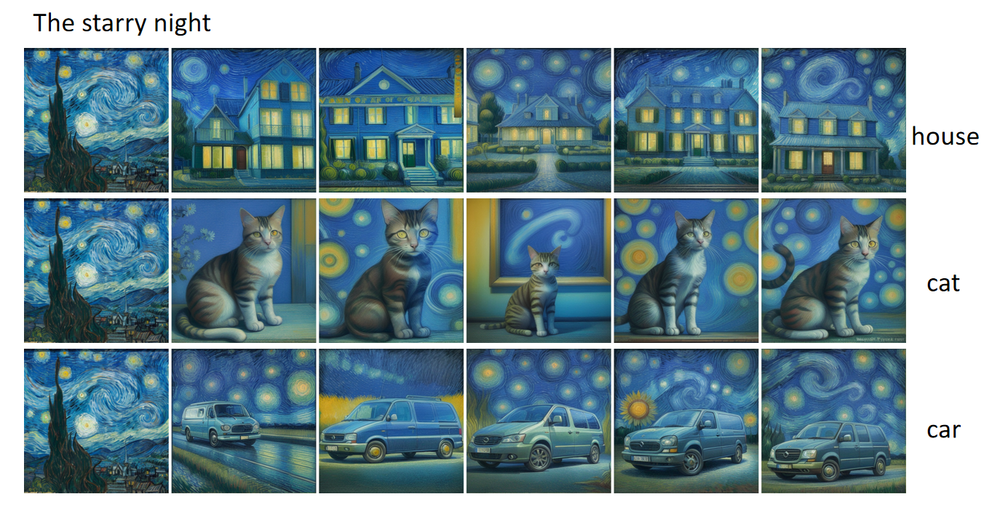

## 🎨 Unofficial implementation of "Visual Style Prompting with Swapping Self-Attention" on SD1.5

## Visual Style Prompting with Swapping Self-Attention

### ArXiv | 📖 [Paper](https://arxiv.org/abs/2402.12974) | ✨ [Project page](https://curryjung.github.io/VisualStylePrompt)

> #### Authors &emsp;&emsp; [Jaeseok Jeong](https://drive.google.com/file/d/19I3s70cfQ45dC_JiD2kmkv0MZ8yu4kBZ/view)<sup>1,2&#42;</sup>, [Junho Kim](https://github.com/taki0112)<sup>1&#42;</sup>, [Yunjey Choi](https://www.linkedin.com/in/yunjey-choi-27b347175/?originalSubdomain=kr)<sup>1</sup>, [Gayoung Lee](https://www.linkedin.com/in/gayoung-lee-0824548a/?originalSubdomain=kr)<sup>1</sup>, [Youngjung Uh](https://vilab.yonsei.ac.kr/member)<sup>2&dagger;</sup> <br> <sub> &emsp;&emsp;&emsp;&emsp;&emsp;&emsp;&emsp;&emsp; <sup>1</sup>NAVER AI Lab, <sup>2</sup>Yonsei University</sub> <br> <sub> &emsp;&emsp;&emsp;&emsp;&emsp;&emsp;&emsp;&emsp; <sup>&#42;</sup>Equal Contribution, <sup>&dagger;</sup>Corresponding author</sub>

> #### 🔆 Abstract
> *In the evolving domain of text-to-image generation, diffusion models have emerged as powerful tools in content creation. Despite their remarkable capability, existing models still face challenges in achieving controlled generation with a consistent style, requiring costly fine-tuning or often inadequately transferring the visual elements due to content leakage. ***To address these challenges, we propose a novel approach, visual style prompting, to produce a diverse range of images while maintaining specific style elements and nuances. During the denoising process, we keep the query from original features while swapping the key and value with those from reference features in the late self-attention layers.*** This approach allows for the visual style prompting without any fine-tuning, ensuring that generated images maintain a faithful style. Through extensive evaluation across various styles and text prompts, our method demonstrates superiority over existing approaches, best reflecting the style of the references and ensuring that resulting images match the text prompts most accurately.*
---

### 🔥 To do
* [x] implementation on SD1.5
* [ ] implementation on 2_rectified_flow_from_sd_1_5

---

### ✨ Requirements
```
> pytorch 1.13.1
> pip install --upgrade diffusers accelerate transformers einops kornia gradio triton xformers==0.0.16
```
### ✨ Usage
#### 👉 w/ User image
```
> python vsp_real_script_sd15.py --img_path assets/real_dir --tar_obj cat --output_num 5 --color_cal_start_t 150 --color_cal_window_size 50
```
* For better results, you can add more style description only to inference image by directly editing code.
  * `vsp_real_script.py -> def create_prompt`
  * Save your images in the `style_name.png` format.
    * 

      
    
      
    
      
    
      
  
  ### ✨ change
  
  * vsp_real_script_sd15.py     
  * pipeline_stable_diffusion_sd15.py
  * inverted_ve_pipeline.py 
---
### 📚 Citation
```bibtex
@article{jeong2024visual,
  title={Visual Style Prompting with Swapping Self-Attention},
  author={Jeong, Jaeseok and Kim, Junho and Choi, Yunjey and Lee, Gayoung and Uh, Youngjung},
  journal={arXiv preprint arXiv:2402.12974},
  year={2024}
}
```

---
### ✨ License
```
Visual Style Prompting with Swapping Self-Attention
Copyright (c) 2024-present NAVER Cloud Corp.

Licensed under the Apache License, Version 2.0 (the "License");
you may not use this file except in compliance with the License.
You may obtain a copy of the License at

    http://www.apache.org/licenses/LICENSE-2.0

Unless required by applicable law or agreed to in writing, software
distributed under the License is distributed on an "AS IS" BASIS,
WITHOUT WARRANTIES OR CONDITIONS OF ANY KIND, either express or implied.
See the License for the specific language governing permissions and
limitations under the License.
```
